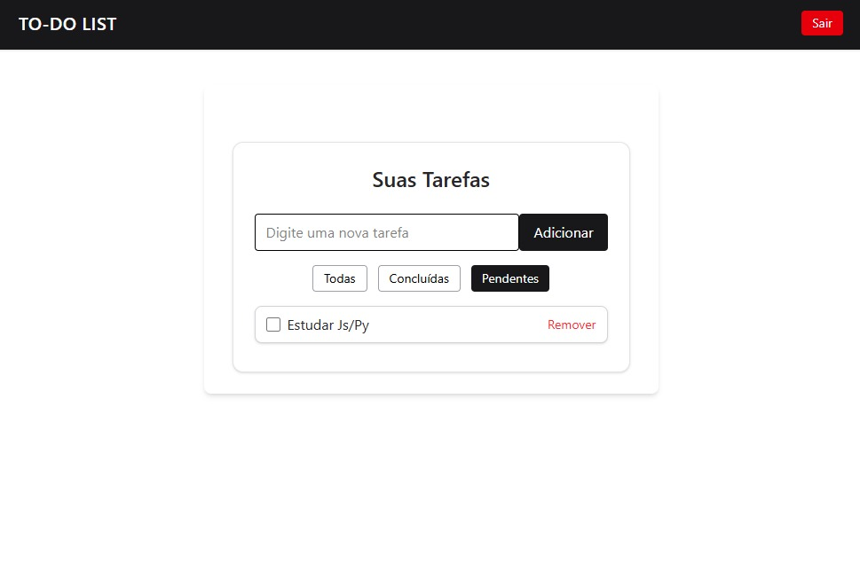

# To-do-list

Uma aplicação **To-do List em React**, criada para treinar **componentização**, **gerenciamento de estado global com Recoil**, **hooks**, **otimização com memo**, organização de pastas e estilização com **TailwindCSS**.

A aplicação permite **adicionar**, **filtrar**, **concluir** e **remover tarefas**, além de salvar o usuário e suas tarefas no **LocalStorage**, mantendo os dados mesmo após atualizar a página.

## Conceitos aplicados

- **useState** e **useEffect** → controle de estados e efeitos colaterais
- **Recoil** → gerenciamento de estado global com `atoms` e `selectors`
- **useMemo / memo** → otimização de renderizações
- **Custom Hook (`useLocalStorage`)** → persistência de dados no navegador
- **Componentização clara** → código organizado, reutilizável e de fácil manutenção

## Visualização

<p align="center">
  
  
  
</p>

## Estrutura dos Arquivos

```
src/
├── atoms/ # Estados globais com Recoil
│ ├── filterAtom.js
│ └── TodoAtom.js
│
├── selectors/ # Estados derivados (filtros)
│ └── filteredTodosSelector.js
│
├── components/ # Componentes da aplicação
│ ├── Layout.jsx
│ ├── Login.jsx
│ ├── TodoApp.jsx
│ ├── TodoFilters.jsx
│ ├── TodoForm.jsx
│ ├── TodoItem.jsx
│ └── TodoList.jsx
│
├── hooks/ # Hooks personalizados
│ └── useLocalStorage.js
│
├── assets/
│ └── to-do-list.jpg # Imagem do projeto
│
├── App.jsx
├── App.css
├── index.css
├── main.css
└── index.jsx
```

---

## Tecnologias Utilizadas


## Como Utilizar / Baixar o Projeto

1. **Clone o repositório:**

```bash
git clone https://github.com/ItsRAYKA/EBAC-Projetos-Exerc-cios.git
```

2. **Acesse a pasta do projeto:**

```bash
cd To-do-list/lista
```

3. **Instale as depedências:**
   
```bash
npm install
```

4. **Instale as depedências:**

```bash
npm run dev
```
4. **Abra no navegador:**

```bash
http://localhost:5173/
```
---


